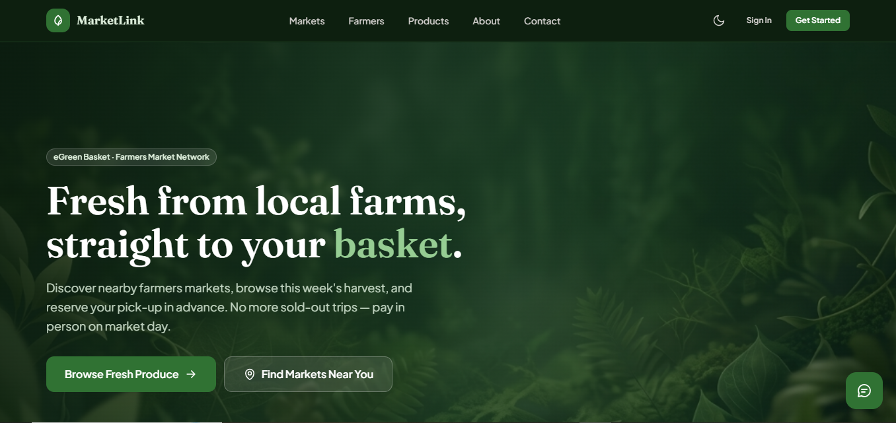
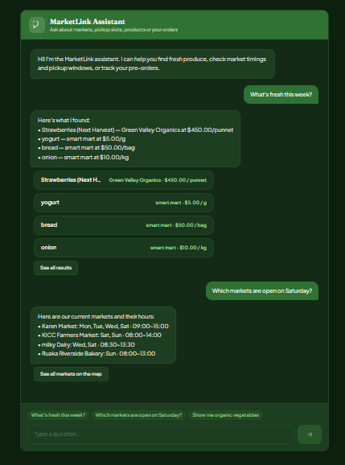
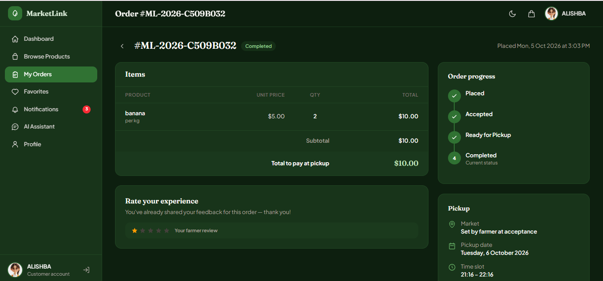
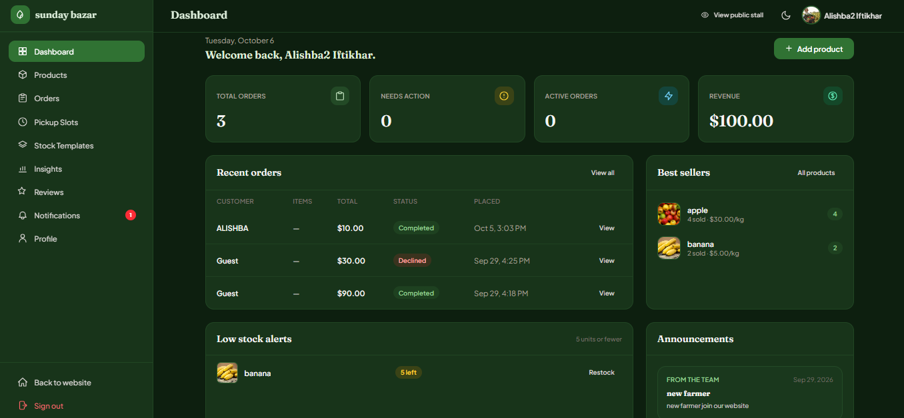
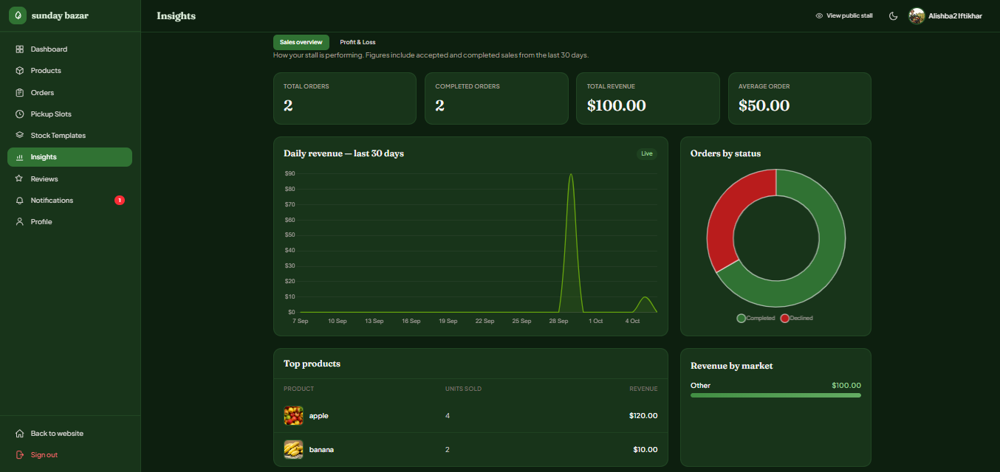
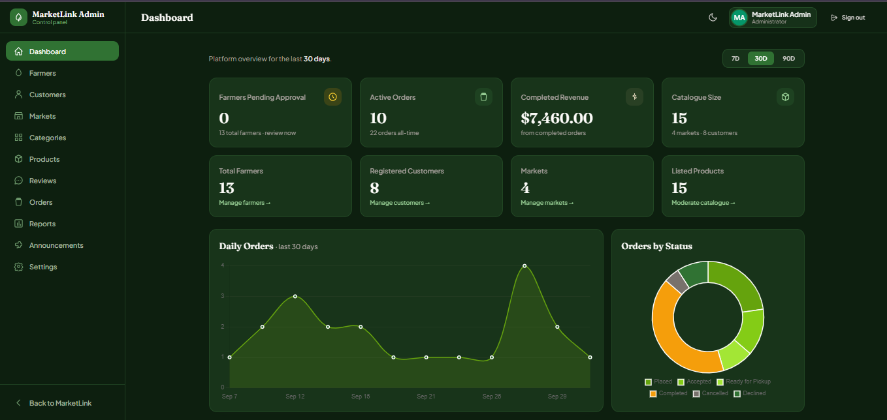
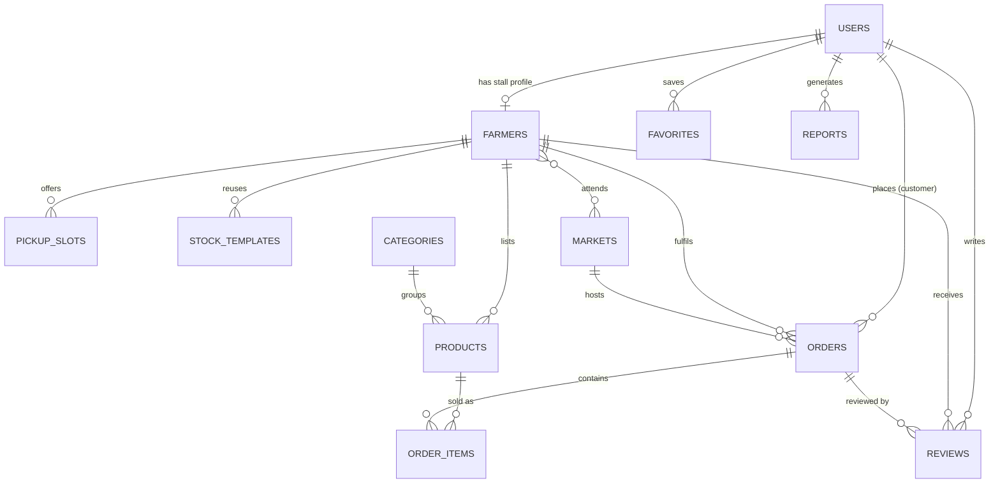

# 🌿 MarketLink

### Farm Fresh Just a Click Away

MarketLink is a Laravel web application that connects local farmers-market sellers with customers. Farmers publish weekly stock and pickup windows; customers pre-order and reserve a pickup slot, then collect and pay in person at the market.


> Developed by a five-person team for Aptech TechWiz 7 – The World Tech Championship.

---

## 📸 Screenshots

### 🏠 Customer Experience

|             Home             |               AI Assistant         |
| :--------------------------: | :--------------------------------: |
|  |  |


|             Customer Orders             |
| :-------------------------------------: |
|  |

### 🌾 Farmer Experience

|              Farmer Dashboard             |             Farmer Insights             |
| :---------------------------------------: | :-------------------------------------: |
|  |  |

### 🛠️ Admin Experience



---

## Demo / Preview

No hosted demo or demo video is linked from this repository. The app runs locally in a few minutes with seeded data (see [Quick Start](#quick-start)), and the demo accounts below cover all three roles.

Good screens to explore after seeding:

| Role     | Screen                                  | Route                  |
| :------- | :-------------------------------------- | :--------------------- |
| Customer | Market and farmer directories with maps | `/markets`, `/farmers` |
| Customer | Product catalogue with filters          | `/products`            |
| Customer | Checkout with per-farmer pickup slots   | `/customer/checkout`   |
| Customer | Order tracking                          | `/customer/orders`     |
| Farmer   | Sales insights and charts               | `/farmer/insights`     |
| Farmer   | Pickup slot management                  | `/farmer/pickup-slots` |
| Admin    | Platform dashboard                      | `/admin/dashboard`     |

---

## Overview

Shoppers at farmers markets rarely know which farmers will attend, what is in stock this week, or what things cost, and popular items often sell out before they arrive. Farmers, in turn, have no simple way to publish weekly stock, take pre-orders, or stay in touch with regular customers.

MarketLink gives every approved farmer an online stall. Customers browse markets, farmers and products, fill one basket, and place a pre-order with each farmer for a specific pickup date and time slot. Farmers accept, prepare and complete orders; admins approve farmers and run the platform.

Payment is handled in person at pickup. There is no online payment gateway and no delivery.

---

## Key Features

* **Farmer-wise pre-order checkout:** the basket is split by farmer, creating one pre-order per farmer, each with its own pickup date and slot.
* **Order lifecycle and cutoff logic:** orders move through a defined status flow, and customers can modify or cancel only before a per-order cutoff.
* **Role-based access and farmer approval:** separate customer, farmer and admin areas; new farmers stay in `pending` until an admin approves them.
* **Email OTP verification:** 6-digit codes with expiry, attempt limits, resend cooldown and rate limiting, used for registration and password reset.
* **Google sign-in:** OAuth through Laravel Socialite; new Google users choose a role and then verify by OTP.
* **Analytics and reporting:** farmer insights (30-day sales chart, top products, revenue by market), an admin dashboard with 7/30/90-day charts, and six downloadable CSV reports.
* **Maps:** Leaflet and OpenStreetMap maps for markets and stalls, with a draggable pin for setting coordinates and a directions link.
* **Notifications:** in-app and email notifications for new orders, order status changes, and restocked favorites.

Supporting features include product CRUD with images, a sold-out toggle, reusable weekly stock templates, search and filters (category, market, market day, price), reorder, favorites, reviews with public farmer replies, announcements, admin settings, a rule-based chat assistant, and dark mode.

---

## User Roles

### Customer

* Browses markets, farmers and products (no login needed to browse)
* Fills a basket and places pre-orders with pickup slots
* Tracks, modifies, cancels and reorders orders
* Saves favorites and leaves 1–5 star reviews on completed orders

### Farmer

* Registers and waits for admin approval
* Manages the stall profile (map pin, operating days, markets, order cutoff), products, stock templates and pickup slots
* Accepts, declines, prepares and completes orders
* Reads insights and replies to reviews

### Admin

* Approves, suspends and restores farmers; activates or deactivates customers
* Manages markets, categories and announcements
* Moderates products and reviews
* Views platform metrics and generates CSV reports

---

## Core Workflow

```text
Customer browses → selects products → basket is grouped by farmer
→ chooses a pickup slot per farmer → places pre-order
→ farmer accepts → order is ready for pickup
→ customer collects and pays in person → order completed
```

Order statuses: `placed → accepted → ready_for_pickup → completed`, with `cancelled` and `declined` as end states.

**Cutoff rule:** a customer can modify or cancel an order while it is `placed` or `accepted` and before its cutoff time. The cutoff is the pickup slot start minus the farmer's configured `order_cutoff_hours` (default 24, configurable from 0 to 168).

---

## Tech Stack

| Layer          | Technology                               |
| :------------- | :--------------------------------------- |
| Backend        | Laravel 12 / PHP 8.2+                    |
| Database       | MySQL                                    |
| Frontend       | Blade, Tailwind CSS, Alpine.js           |
| Build          | Vite                                     |
| Maps           | Leaflet + OpenStreetMap                  |
| Charts         | Chart.js                                 |
| Authentication | Laravel auth, email OTP, Google OAuth    |
| OAuth          | Laravel Socialite                        |
| Mail           | SMTP (Gmail App Password in development) |
| Testing        | PHPUnit                                  |

---

## Engineering Decisions

* **One order per farmer.** Checkout groups the basket by farmer and creates a separate order for each, with its own pickup date, slot and status. This lets each farmer fulfil and track their orders independently.
* **Cutoff stored on the order.** `cutoff_at` is saved on each order, and `Order::canBeModified()` and `canBeCancelled()` apply the rule, so modify/cancel eligibility is decided in one place instead of scattered across controllers.
* **Explicit order state machine.** A fixed status flow with defined end states keeps farmer actions predictable and drives customer notifications on every status change.
* **Layered access control.** A `role` middleware separates the three areas, and a `farmer.approved` middleware confines pending farmers to a waiting page and their profile. Suspended accounts are logged out on their next request, controllers check order ownership, and `OrderPolicy` and `ProductPolicy` cover order and product authorization.
* **OTP as its own concern.** Codes live in a dedicated `otps` table keyed by email and purpose (`registration`, `password_reset`), are stored only as hashes, and are throttled separately for verify and resend.
* **Polymorphic favorites.** Farmers, products and markets share one `favorites` table using a morph map. The links are logical rather than foreign keys, which keeps a single favorite flow for three entity types.

---

## Architecture

<details>
<summary><b>Entity relationships</b></summary>

<br />



`favorites.favoritable_type` is `farmer`, `product` or `market` (registered with `Relation::morphMap`). Supporting tables not drawn: `announcements`, `settings`, `otps`, `notifications`, and Laravel's session, cache and queue tables.

</details>

---

## Authentication & Security

* **Email OTP:** 6-digit code, 10-minute expiry, 5 attempts, 60-second resend cooldown, stored only as a bcrypt hash. Verify and resend endpoints are rate-limited (12 and 6 requests per minute). Used for registration, first-time Google sign-up and password reset.
* **Google OAuth:** handled with Laravel Socialite. Existing accounts are matched by `google_id` or email, and suspended accounts are refused.
* **Passwords:** hashed with bcrypt and validated with Laravel's password rules on the server, mirrored by a live checklist in the browser.
* **Authorization:** role and farmer-approval middleware, order ownership checks in controllers, and policies for orders and products.
* **Input limits:** phone numbers, coordinate ranges, image uploads (images only, 4 MB maximum) and assistant messages (500 characters, 40 requests per minute) are validated.
* **Framework protections:** CSRF tokens, Blade output escaping and Eloquent query binding are relied on rather than reimplemented. Secrets stay in a git-ignored `.env`.

---

## Maps & Geolocation

Leaflet with OpenStreetMap tiles (no API key required) powers the markets directory, farmer directory, stall pages and checkout. Farmers and admins set coordinates by dragging a pin, which updates the latitude and longitude fields (and vice versa). A "Get directions" link opens OpenStreetMap routing for the selected market or stall. Map data © OpenStreetMap contributors.

---

## Testing

```bash
php artisan test
# or
composer test
```

Feature tests are in `tests/Feature/MarketLinkCompleteTest.php`. `phpunit.xml` runs them against an in-memory SQLite database, so the `pdo_sqlite` PHP extension must be enabled. Test counts and coverage figures are not published here.

---

## Quick Start

**Prerequisites:** PHP 8.2+, Composer 2, a current Node.js LTS release, and MySQL 8.x.

From the project root:

```bash
composer install
npm install
cp .env.example .env          # Windows (cmd): copy .env.example .env
php artisan key:generate
```

`.env.example` contains Laravel defaults (SQLite, log mailer), so update these values in `.env`:

```dotenv
APP_URL=http://127.0.0.1:8000

DB_CONNECTION=mysql
DB_HOST=127.0.0.1
DB_PORT=3306
DB_DATABASE=marketlink
DB_USERNAME=root
DB_PASSWORD=

SESSION_DRIVER=database
CACHE_STORE=database
QUEUE_CONNECTION=database
```

Create the database, then migrate, seed and run:

```bash
mysql -u root -e "CREATE DATABASE marketlink CHARACTER SET utf8mb4 COLLATE utf8mb4_unicode_ci;"
php artisan migrate --seed
php artisan storage:link
npm run build
php artisan serve --host=127.0.0.1 --port=8000
```

Open `http://127.0.0.1:8000`.

(`composer dev` runs the server, queue listener, log viewer and Vite together for development.)

**Email:** with the default `MAIL_MAILER=log`, emails (including OTP codes) are written to `storage/logs/laravel.log`. To send real mail, configure SMTP; for Gmail this needs a 16-character App Password in `MAIL_USERNAME`, `MAIL_PASSWORD` and `MAIL_FROM_ADDRESS`.

**Google sign-in (optional):** set `GOOGLE_CLIENT_ID`, `GOOGLE_CLIENT_SECRET` and `GOOGLE_REDIRECT_URI=http://127.0.0.1:8000/auth/google/callback`. Use the same `127.0.0.1` host in `APP_URL`, the Google Console redirect URI and the browser address bar, and run `php artisan config:clear` after editing `.env`.

---

## Demo Credentials

Local demo data created by `php artisan migrate --seed`. These accounts are for local evaluation only and must not be used in any real deployment.

| Role              | Email                        | Password      |
| :---------------- | :--------------------------- | :------------ |
| Admin             | `admin@marketlink.test`      | `Password123` |
| Customer          | `amara.njoroge@example.com`  | `Password123` |
| Farmer (approved) | `wanjiku.mwangi@example.com` | `Password123` |
| Farmer (pending)  | `faith.njeri@example.com`    | `Password123` |

Seeded accounts are already email-verified, so login skips the OTP step. Register a new account to see the OTP flow. The pending farmer lands on a waiting page until approved from **Admin → Farmers**. All seeded names, stalls, coordinates and phone numbers are fictional.

---

## Design Decisions & Scope

* **No online payment gateway, by design.** Payment happens in person at pickup, and checkout says so.
* **Pickup only.** There is no delivery or courier logic.
* **Farmers require approval** before they can operate on the platform.
* **Rule-based assistant.** The chat assistant answers market hours, pickup windows, farmer info, order status and product searches without an external AI model.

---

## Known Limitations

* The app is documented for local development only; no hosted deployment is described here.
* Admin reports are exported as CSV only.
* Tests run on in-memory SQLite, while the application targets MySQL.
* Gmail SMTP is suited to development use, not high-volume production mail.

---

## Team

* Alishba Iftikhar
* Alishba Jawaid
* Manal Anis
* Faiza Faisal
* Ahsun Rehan

MarketLink is a collaborative project, and credit belongs to all five members.

---

## AI Disclosure

AI coding assistants (Qoder and Claude by Anthropic) were used for coding help, debugging and code review. The team reviewed and tested the resulting changes.

---

## License

No open-source license has been applied to this repository; the code is shared for review and evaluation.
